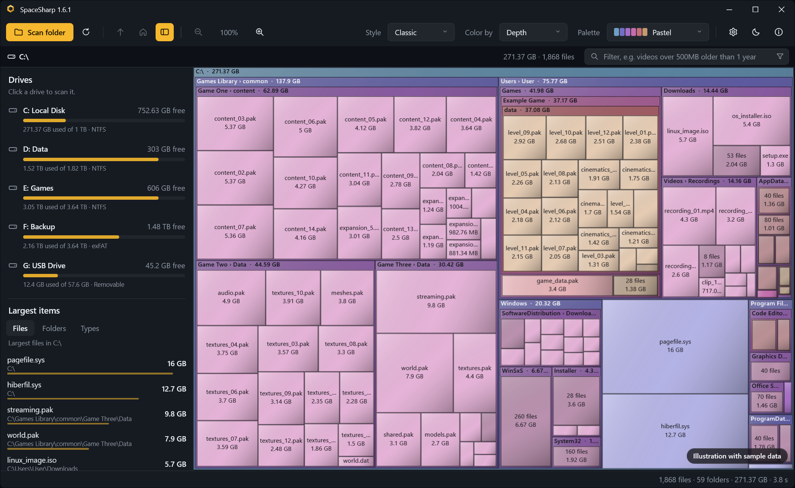
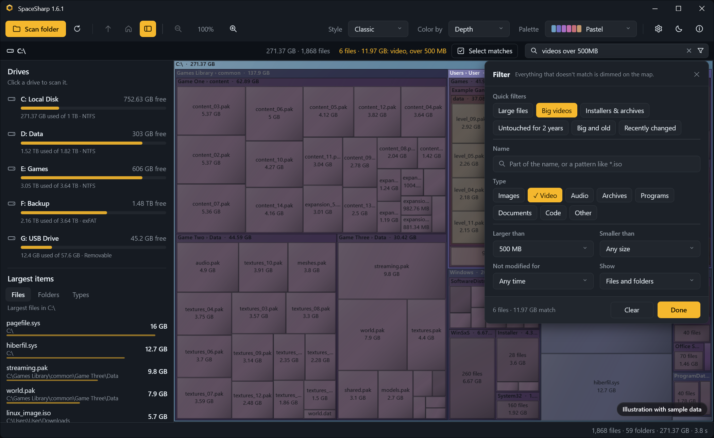
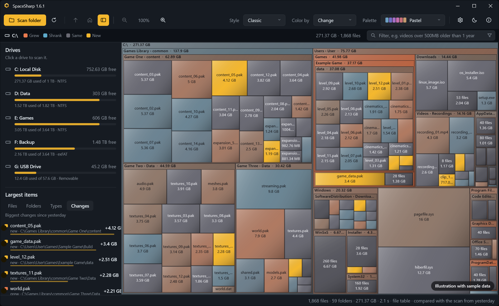
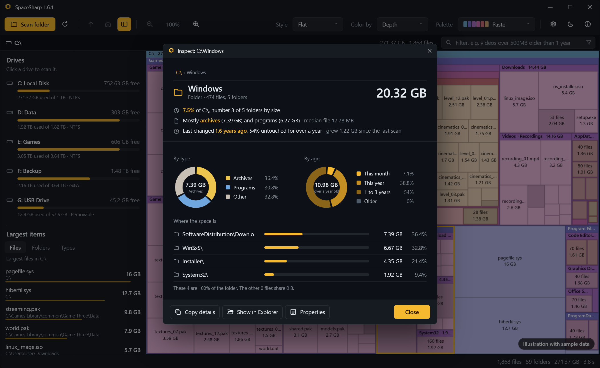
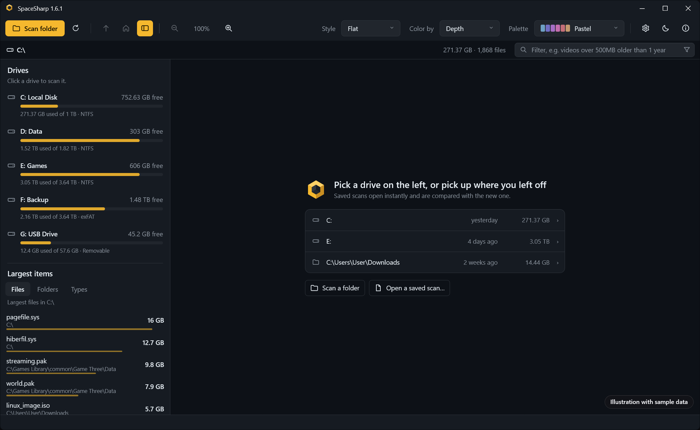
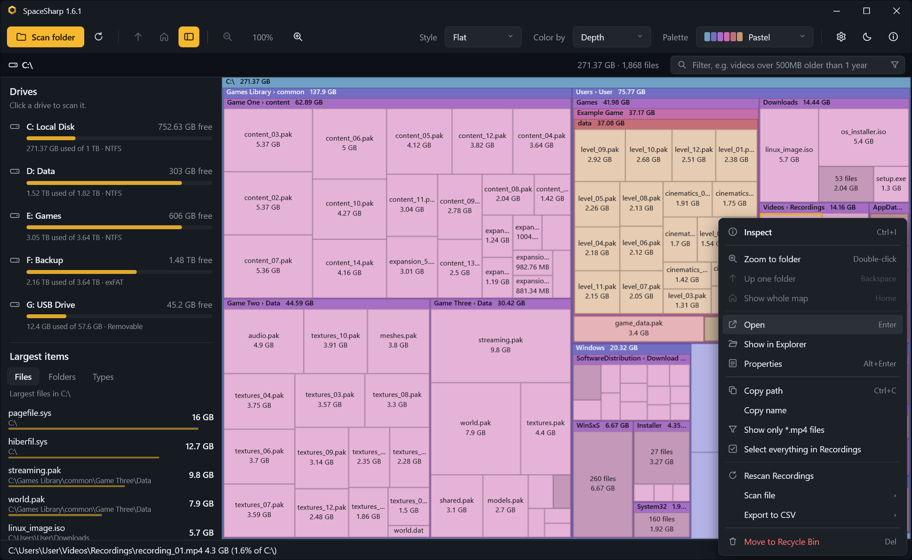
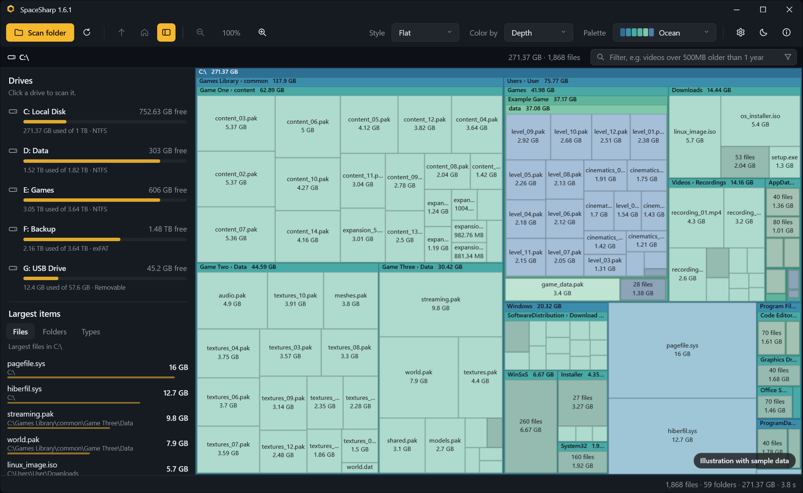
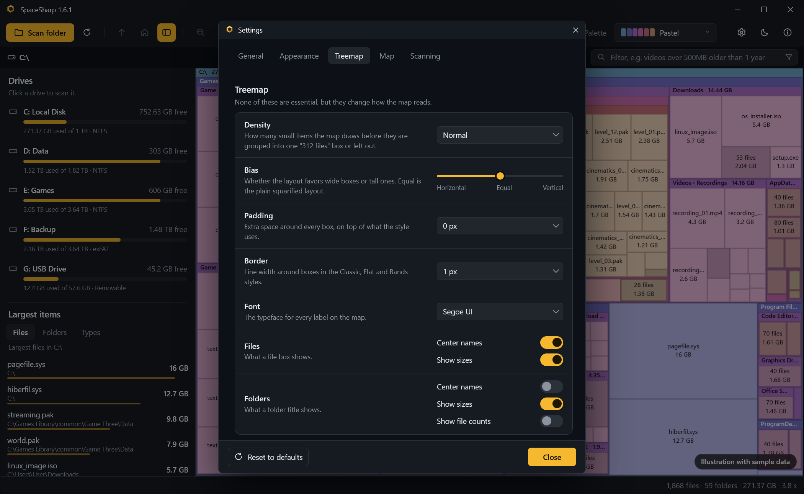
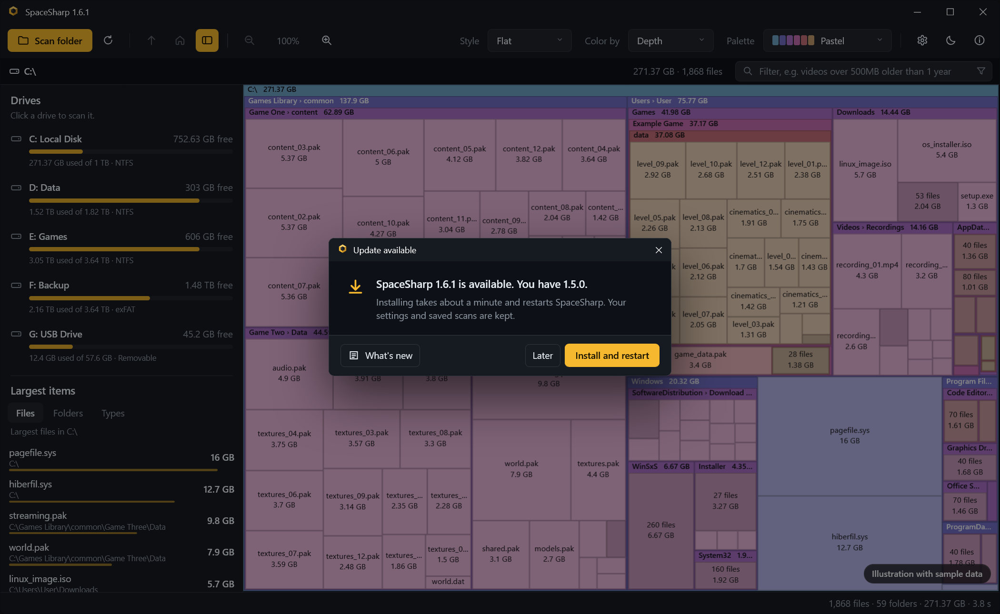
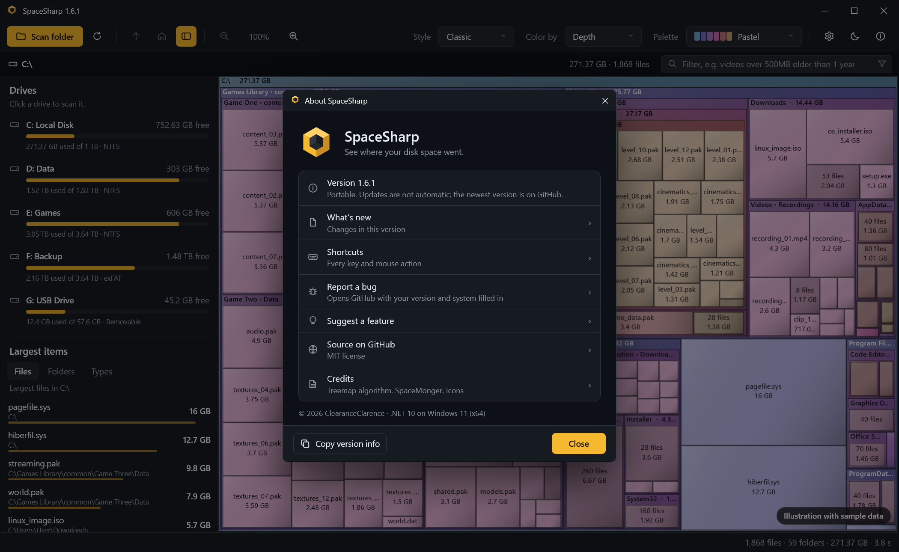

<p align="center">
  
</p>

<p align="center">
  See where your disk space went.<br>
  A fast, zoomable treemap of your drives for Windows, in the spirit of <a href="https://www.stardock.com/products/spacemonger/">SpaceMonger</a>.
</p>

<p align="center">
  <a href="https://github.com/ClearanceClarence/SpaceSharp/releases/latest"></a>
  <a href="https://github.com/ClearanceClarence/SpaceSharp/actions/workflows/tests.yml"></a>
  <a href="CHANGELOG.md"></a>
  <a href="LICENSE"></a>
  
  
</p>

<p align="center">
  <a href="https://clearanceclarence.github.io/SpaceSharp/"></a>
  <a href="https://github.com/ClearanceClarence/SpaceSharp/releases/latest/download/SpaceSharp.exe"></a>
</p>

<p align="center">
  <a href="https://www.producthunt.com/products/spacesharp?utm_source=badge-follow&utm_medium=badge&utm_source=badge-spacesharp" target="_blank"></a>
  <a href="https://alternativeto.net/software/spacesharp/about/?utm_source=badge&utm_medium=referral" target="_blank"></a>
  <a href="https://sourceforge.net/projects/spacesharp/files/latest/download"></a>
</p>

<p align="center">
  
  <br>
  <sub>The map. Every file and folder is a box sized by the space it uses; folders carry a title bar and their contents inside. Sample data.</sub>
</p>

<table align="center">
  <tr>
    <td align="center" width="50%"><a href="docs/shot-filter.png"></a><br><sub><b>Filter in plain words.</b> "videos over 500MB older than 1 year" lights the matches and dims the rest.</sub></td>
    <td align="center" width="50%"><a href="docs/shot-change.png"></a><br><sub><b>What changed.</b> Every scan is saved; the Change mode shows what grew, shrank or appeared since last time.</sub></td>
  </tr>
  <tr>
    <td align="center"><a href="docs/shot-inspect.png"></a><br><sub><b>Inspect.</b> Size and shares, where the space is inside, and donuts by type and by age, with a callout when something stands out.</sub></td>
    <td align="center"><a href="docs/shot-start.png"></a><br><sub><b>Pick up where you left off.</b> Recent scans reopen in one click.</sub></td>
  </tr>
  <tr>
    <td align="center"><a href="docs/shot-menu.png"></a><br><sub><b>Clean up from the map.</b> Open, Inspect, filter by type, Recycle Bin, right from the box.</sub></td>
    <td align="center"><a href="docs/shot-flat.png"></a><br><sub><b>Six styles, eight palettes.</b> Flat in Ocean here; Classic, Tiles, Cards, Bands and Soft too, light or dark.</sub></td>
  </tr>
</table>

<p align="center">
  <a href="docs/shot-settings.png"></a>
  <a href="docs/shot-update.png"></a>
  <a href="docs/shot-about.png"></a>
  <br>
  <sub>Treemap options · Update notice · About</sub>
</p>

---

SpaceSharp scans a drive or folder and draws every file and folder as a box whose area matches its size. Folders are boxes with a title bar, and their contents are laid out inside them, so the files and folders eating your space are obvious at a glance. Zoom into any folder, pan around, and send what you don't need to the Recycle Bin without leaving the map.

It's a single, portable `.exe` with no installer and no dependencies.

## Contents

- [Features](#features)
- [Download](#download)
- [Using SpaceSharp](#using-spacesharp)
- [Keyboard and mouse](#keyboard-and-mouse)
- [Building from source](#building-from-source)
- [Publishing an exe](#publishing-an-exe)
- [How it works](#how-it-works)
- [Project structure](#project-structure)
- [Customizing](#customizing)
- [Settings](#settings)
- [Known limitations](#known-limitations)
- [Ideas for the future](#ideas-for-the-future)
- [Feedback](#feedback)
- [Credits](#credits)
- [License](#license)

## Features

**Scanning**
- Scan a whole drive or any folder, with live counts of files, folders and bytes while it runs
- Fast NTFS scan: reads the drive's file table directly, mapping a whole drive in seconds. Windows asks for administrator permission when you scan a drive; an elevated helper does the reading and hands the map back, so the app itself never restarts
- Every drive scan is saved, so the app opens with yesterday's map already on screen and F5 rescans; save and open scans as files to compare machines
- Compare with the previous scan: color by change (grew warm, shrank cool, new in amber), a Changes tab listing what grew most, and "since last scan" in Inspect
- Rescan a single folder from the right-click menu; the rest of the map stays put
- Export the largest files, a folder, the filter matches or the changes to CSV (a plain first version: fixed columns, no options yet)
- Leave out names such as `node_modules` or `*.tmp` from every scan
- Parallel folder walk for everything else: single folders, other file systems, and runs without administrator rights
- Includes hidden and system files; skips junctions and symbolic links to avoid loops and double counting
- Folders that can't be read are flagged instead of stopping the scan, and a notice offers to restart as administrator
- Measures **file size** or **size on disk** (compressed size rounded to whole clusters), switchable at any time
- Optional hard-link detection so data with several names (like `WinSxS`) is counted once
- Cancel at any time with Esc

**The map**
- Squarified treemap layout, which keeps boxes close to square so sizes are easy to compare
- Nested folders with title bars showing name and size
- Chains of folders that only contain one folder (like `Users › Alex › AppData › Local`) are merged into a single box with a combined title, instead of a stack of thin frames
- Folders with hundreds of small files (a photo shoot, a cache) show one "312 files" box instead of a grid of specks; zooming in reveals them individually
- Boxes too small to see are left out, so the map stays clean instead of turning into noise
- Six map styles: Classic (title bars, borders and soft shading), Flat, Tiles, Cards, Bands and Soft, switchable from the toolbar; S cycles
- Readability options: five label sizes and outlined labels that stay legible on any color
- A gray "Free space" block when scanning a whole drive, so the map shows the entire disk

**Zoom and navigation**
- Double-click a folder and the view flies in until it fills the window
- Mouse-wheel zoom around the cursor, up to 1,000,000×, with crisp labels at every level
- Drag with the left or middle mouse button to pan
- Clickable breadcrumb path: click any folder in it to zoom there
- Up one folder, show the whole map, and zoom buttons in the toolbar

**Finding things**
- Filter box: type `*.mp4`, `>500MB`, `older than 1 year`, `type:video` or part of a name, and everything that doesn't match dims. The layout stays put, so you see *where* the matches are. Terms combine.
- **Select matches** (Ctrl+A) selects every matching file, and Del sends them all to the Recycle Bin in one go
- Side panel (L) with all your drives, their usage bars and free space, plus the 200 largest files, the largest folders, and space by file type. Click a drive to scan it, a row to zoom to it, or a type to filter by it
- Multi-select with Ctrl+click and Shift+click; the status bar shows the combined size
- Hover details: a small card next to the mouse with size, size on disk, file count, type, last modified and share of the current folder

**Colors and themes**
- Color boxes by nesting depth or by file type (images, video, audio, archives, programs, documents, code)
- Eight palettes: Pastel, Retro, Ocean, Sunset, Forest, Neon, Monochrome and Color-blind safe, plus your own as JSON files (Settings › Custom palettes › Open folder; an example and a README are written for you)
- Label text automatically switches between dark and light to stay readable on every color
- Light and dark themes, or follow the Windows setting and switch live when it changes
- Title bars follow the theme on Windows 10 and 11

**Cleaning up**
- Right-click any box to inspect it, open it, show it in Explorer, open its Windows Properties, copy its path or name, filter the map to its file type, select everything in its folder, or move it to the Recycle Bin
- Deleting is undoable (it goes to the Recycle Bin) and the map updates without a rescan
- Rescan (F5) brings you back to the folder you were looking at

**Other**
- Status bar shows the full path, size, share of the current folder and file count for whatever is under the mouse
- About window with version, shortcuts and system info
- Per-monitor DPI aware and long-path aware
- Settings window with theme, palette, size measure, free space, shading, scanning and safety options, all remembered

## Download

Two options on the [Releases](../../releases) page, both for 64-bit Windows 10 and 11 (Windows on ARM works through x64 emulation):

| Download | Best for |
|---|---|
| **SpaceSharp-win-x64.msi** | A regular Windows installer where you **choose the install folder** and whether to install for you or for everyone. Adds a Start menu entry and **updates itself**. |
| **SpaceSharp-win-Setup.exe** | One-click install to your user profile (`%LocalAppData%\SpaceSharp`), no questions asked, no admin rights. Also updates itself. Run it as `SpaceSharp-win-Setup.exe --installto "D:\Apps\SpaceSharp"` to pick another folder. |
| **SpaceSharp.exe** | A single portable file. Nothing to install, but you update it by downloading the new version yourself. |

> [!NOTE]
> The exe isn't code-signed, so Windows SmartScreen may show "Windows protected your PC" the first time you run it. Click **More info**, then **Run anyway**.

The first launch is a little slower than the ones after it, because the portable exe unpacks itself once.

## Using SpaceSharp

1. Click a drive in the **Drives** list on the left, or click **Scan folder** to choose a folder. Each drive shows how full it is and how much is free.
2. When the scan finishes, the whole drive or folder fills the window. The biggest boxes are the biggest space users.
3. Hover over a box to see its full path and size in the status bar.
4. Double-click a folder to zoom into it. Use Backspace, the mouse back button, the breadcrumb or the mouse wheel to zoom back out.
5. Right-click a file or folder for the full menu: Inspect (size and shares, where the space is, by type and by age, change since the last scan), Open, Show in Explorer, Properties, copy, filter to its type, select its folder, or move it to the Recycle Bin.

To see protected system folders, run SpaceSharp as administrator. Otherwise those folders are skipped and marked as unreadable.

### Settings

The gear button in the toolbar (or Ctrl+,) opens the settings window. Every change applies immediately and is saved.

| Setting | What it does |
|---|---|
| **Theme** | Match Windows, Light or Dark. |
| **Palette** and **Color by** | The same choices as in the toolbar. |
| **Map style** | Classic (with soft shading), Flat, Tiles, Cards, Bands or Soft. Same layout, different look; S cycles. |
| **Treemap › Density** | How many small items are drawn before grouping or leaving them out: Sparse, Normal, Dense, Maximum, or Everything for no grouping at all. G switches to Everything and back. |
| **Treemap › Bias** | Horizontal, Equal or Vertical: whether the layout favors wide or tall boxes. Equal is the plain squarified layout. |
| **Treemap › Padding, Border, Font** | Extra space around boxes, border width for the styles that draw one, and the label typeface. |
| **Treemap › Files, Folders** | Center names, show sizes, and for folders show file counts in the title. |
| **Label size** | Smallest, Smaller, Normal, Large or Larger text on the map. Title bars shrink and grow to match. |
| **Outlined labels** | A thin contrasting outline around every label. Recommended if the map is hard to read. |
| **Size measure** | File size, or size on disk: the compressed size of compressed, sparse and cloud files, rounded up to whole clusters, like Explorer's "Size on disk". |
| **Show free space** | Adds a gray block for the drive's unused space when a whole drive is scanned. Off by default. |
| **Merge single-folder chains** | Draw folders that only contain one folder as a single box with a combined title. |
| **Hover details** | The info card next to the mouse. |
| **Show side panel** | The panel on the left with your drives and the largest items. |
| **Animate zoom** | Fly into folders instead of jumping. |
| **App language** | Same as Windows, English, or Norwegian bokmål; any language with a translation in `Resources/Strings.<culture>.resx` appears in the list on its own. Restart to switch. |
| **Keep saved scans for** | A week to forever; automatic saves older than this are deleted at startup (default 90 days). A button deletes them all now. Scans you saved as files are never touched. |
| **Leave out** | Names to skip, with everything inside them. One wildcard per line, matched against file and folder names. |
| **Reopen the last scan on startup** | Shows the last map at once, compared with the scan before it. Scans are kept in `%LocalAppData%\SpaceSharp\scans`. On by default. |
| **Fast NTFS scan** | Reads the drive's Master File Table instead of walking folders, so a whole drive takes seconds. Needs administrator rights and an NTFS volume; otherwise the normal scan runs. On by default. |
| **Include hidden and system files** | Off leaves out Hidden and System items such as `pagefile.sys`. Applies to the next scan. |
| **Count hard links once** | Reads every file's link count so data with several names (Windows keeps thousands in `WinSxS`) is counted once. Slower on big drives, off by default, applies to the next scan. |
| **Confirm before moving to the Recycle Bin** | Ask before deleting. |
| **Check for updates on startup** | Installed copies look for a new release on GitHub a few seconds after launch. The portable exe can't update itself. |

**Reset to defaults** puts everything back. When folders couldn't be read, a notice appears under the toolbar with a **Restart as administrator** button; SpaceSharp restarts elevated and scans the same drive again.

### Filtering

Press Ctrl+F or click the filter box above the map. Everything that doesn't match is dimmed; the layout stays put so you can see where the matches are.

**The easy way:** click the funnel button in the box. A panel opens with quick filters ("Large files", "Big videos", "Untouched for 2 years"…), a name field, file type chips, size and age drop-downs, and a files/folders switch. It writes the filter text for you, so you can also learn the syntax from it.

**The fast way:** type it. Plain language works: `videos over 500MB not touched in 2 years`, `photos larger than 10 MB`, `.iso`, `installer`. Everything you type must match. The parts it understands:

| You can type | Meaning |
|---|---|
| `*.mp4 *.mkv`, `.iso`, `report` | Name patterns (OR-ed), an extension, or text the name contains |
| `videos`, `photos`, `music`, `archives`, `programs`, `documents`, `code`, `type:video,audio` | File type |
| `>1GB`, `over 500 MB`, `larger than 2 GB`, `at least 100MB` | Minimum size (a bare number means MB) |
| `<10MB`, `under 1 GB`, `smaller than 500MB` | Maximum size |
| `older than 2 years`, `not modified in 6 months`, `unused for 1 year`, `over 3 years old` | Not changed for that long |
| `newer than 30 days`, `modified in the last week`, `last 2 months` | Changed recently |
| `files`, `folders`, `is:file`, `is:folder` | Only files or only folders |

The bar then shows how many files match and their total size. **Select matches** (Ctrl+A) selects all of them, and Del sends them to the Recycle Bin in one go.

### Color modes

| Mode | What the colors mean |
|---|---|
| **Top folder** (default) | Each top-level folder gets one hue, and everything inside it is that hue, a step lighter at each level. Where you are in the tree reads at a glance. |
| **Depth** | Each nesting level gets its own color, like classic SpaceMonger. Files are a lighter shade of their folder's color. |
| **File type** | Files are colored by category (images, video, audio, archives, programs, documents, code, other) and folders are neutral gray. A legend appears next to the breadcrumb. |

### Palettes

| Palette | Look |
|---|---|
| Pastel | Soft colors, the default |
| Retro | Bright primaries, close to classic SpaceMonger |
| Ocean | Blues and teals |
| Sunset | Reds, oranges and plums |
| Forest | Greens and earth tones |
| Neon | Dark folders with bright neon files |
| Monochrome | Grays, with archives in amber in file-type mode |
| Color-blind safe | The Okabe-Ito palette, distinguishable with all common types of color blindness |

#### Your own palettes

Palettes are JSON files in `%LocalAppData%\SpaceSharp\palettes`, one file per palette. Settings › Appearance › **Custom palettes** › **Open folder** creates the folder with an `Example.json` and a `README.txt`, and opens it. Copy the example, rename it, change the colors, then press **Reload** in Settings (or restart). Custom palettes appear under their own **Custom** header in the toolbar's palette list, after the built-in ones.

The smallest valid file:

```json
{ "name": "Mine", "folders": ["#5B8DEF", "#49B86B", "#E8C547", "#E8864A"] }
```

| Field | Meaning |
|---|---|
| `name` | Shown in the list. If left out, the file name is used. |
| `folders` | Required. 1 to 12 colors as `#RRGGBB`. Cycled by depth in Depth mode, by top-level folder in Top folder mode. |
| `files` | Optional. Colors for files. Without it, the folder colors lightened by `fileTint`. |
| `fileTint` | Optional, 0 to 0.9, default 0.45. |
| `categories` | Optional. Colors for File type mode by name: `images`, `video`, `audio`, `archives`, `programs`, `documents`, `code`, `other`. Missing ones are derived from `folders`. |
| `neutral` | Optional. 1 to 6 greys for folders in File type mode. |

Comments and trailing commas are allowed in the files. A file that can't be read is listed with the reason on the Settings page, and the rest still load.

## Command line and Explorer

| | |
|---|---|
| `SpaceSharp.exe D:\` | Scan a drive or folder right away |
| `SpaceSharp.exe scan.sscan` | Open a saved scan (`--open` does the same) |
| `SpaceSharp.exe --compare old.sscan D:\` | Scan `D:\` and compare it with a saved scan |
| `SpaceSharp.exe --help` | Show these options |

Only one SpaceSharp runs at a time: starting it again brings the open window forward and passes it the drive, folder or saved scan you asked for.

Settings › Windows › **"Scan with SpaceSharp" in Explorer** adds an entry to the right-click menu of folders, drives and the folder background in File Explorer. It is written for the current Windows user only and needs no administrator rights; turn it off before moving the portable exe, since the entry points at the file.

## Keyboard and mouse

| Input | Action |
|---|---|
| Double-click, Enter | Zoom the map to a folder (a file zooms to its folder) |
| Mouse wheel | Zoom in or out around the cursor |
| `+` / `−` | Zoom in or out around the center |
| Left or middle drag | Pan while zoomed in |
| Backspace, mouse back button | Up one folder |
| Home, Ctrl+0 | Show the whole map |
| F5 | Rescan |
| Ctrl+C | Copy the selected paths |
| Ctrl+I | Inspect the selection: size and shares, where the space is inside, by type and by age |
| Ctrl+S | Save the scan to a file |
| Ctrl+O | Open a saved scan |
| Alt+Enter | Windows Properties for the selected item |
| Ctrl+click, Shift+click | Select several items |
| Ctrl+F | Filter the map |
| Ctrl+A | Select every file matching the filter |
| L | Largest files, folders and types panel |
| Ctrl+, | Settings |
| Del | Move the selected items to the Recycle Bin |
| S | Next map style |
| K | Next color mode (top folder, depth, file type, change) |
| G | Switch Density to Everything (no grouping) and back |
| Esc | Cancel a scan |
| F1 | About |

## Building from source

**Requirements**
- Windows 10 or 11
- [.NET 10 SDK](https://dotnet.microsoft.com/download)
- JetBrains Rider, Visual Studio 2022 or later, or just the command line

**With Rider**
1. Open `SpaceSharp.sln`.
2. Press **Run** (Shift+F10).

**From the command line**, in the cloned repository:

```powershell
dotnet run --project .\SpaceSharp\SpaceSharp.csproj
```

The app's only NuGet dependency is Velopack, used for the installer and updates.

**Tests**

`SpaceSharp.Tests` covers the parts that don't need a screen: the treemap layout, the filter parser and matcher, size formatting, and the tree operations behind delete and free space.

```powershell
dotnet test
```

Every push and pull request runs the test suite on GitHub Actions (`.github/workflows/tests.yml`); that workflow tests only and never publishes, packs or uploads anything. Releases are built locally with the release script below.

## Publishing an exe

Three publish profiles are included in `SpaceSharp/Properties/PublishProfiles`.

**Portable**: one exe with .NET built in. Runs on any 64-bit Windows 10/11 PC. About 30–40 MB.

```powershell
dotnet publish .\SpaceSharp\SpaceSharp.csproj -p:PublishProfile=Portable
```

**Small**: a much smaller exe that needs the [.NET 10 Desktop Runtime](https://dotnet.microsoft.com/download/dotnet/10.0) installed. If it's missing, Windows shows a download prompt.

```powershell
dotnet publish .\SpaceSharp\SpaceSharp.csproj -p:PublishProfile=Small
```

**Installer with auto-update** (Velopack). Install the packaging tool once with `dotnet tool install -g vpk`, then run the release script from the repository root:

```powershell
.\installer\release.ps1
```

It runs the tests, publishes the portable exe and the Velopack folder, downloads the previous release for a delta package, runs `vpk pack` with the MSI options, and finishes with `installer\brand-msi.ps1`, which writes the branded dialog images into the MSI and fixes the desktop shortcut description. This is the only way releases are built; CI builds and tests but never publishes. Add `-SkipDelta` for a first release, or `-Upload` (with `$env:GITHUB_TOKEN` set) to publish straight to a GitHub release. If Windows refuses to run the scripts, `Unblock-File .\installer\*.ps1` once.

The output lands in `Releases\`: `SpaceSharp-win-Setup.exe`, the `.msi`, `SpaceSharp-win-Portable.zip`, the `.nupkg` update packages and `releases.win.json`. Upload **all of them** to the GitHub release, because installed copies read `releases.win.json` and the `.nupkg` files to update. The `installer` folder holds the wizard's welcome, license and finish pages and the two dialog images (`banner.bmp` 493×58, `logo.bmp` 493×312), both generated by `tools/make-assets.py`.

The same steps by hand, if you prefer:

```powershell
dotnet publish .\SpaceSharp\SpaceSharp.csproj -p:PublishProfile=Velopack
vpk download github --repoUrl https://github.com/ClearanceClarence/SpaceSharp
vpk pack --packId SpaceSharp --packVersion 1.6.1 --packDir .\publish\velopack --mainExe SpaceSharp.exe --packTitle SpaceSharp --packAuthors ClearanceClarence --icon .\SpaceSharp\Assets\SpaceSharp.ico --splashImage .\installer\splash.gif --msi --instLocation Either --instWelcome .\installer\welcome.rtf --instLicense .\installer\license.txt --instConclusion .\installer\conclusion.rtf
.\installer\brand-msi.ps1
```

The plain exes are written to `publish\portable\` and `publish\small\`. In Rider, all profiles also show up as run configurations.


## How it works

**Scanning** (`Services/DiskScanner.cs`)
The scanner walks the folder tree on background threads with `DirectoryInfo.EnumerateFileSystemInfos`. The top three levels are scanned in parallel. Sizes are summed bottom-up, and each folder's children are sorted largest first, which the layout depends on. Progress counters are read by the UI a few times per second, so the scan never waits on the UI.

**Layout** (`Layout/Squarify.cs`)
Boxes are placed with the squarified treemap algorithm by Bruls, Huizing and van Wijk. Items are added to a row along the shorter side of the remaining space for as long as that improves the worst aspect ratio in the row, which produces boxes that are close to square.

**Rendering and zoom** (`Controls/TreemapControl*.cs`, one partial class in five files: fields and properties, camera, layout, rendering, input)
The map is a custom WPF element that draws into `DrawingVisual`s instead of creating a control per box, so tens of thousands of boxes stay fast.

Zooming doesn't scale a picture. The map is laid out again on a virtual canvas that is the window size times the zoom level, shifted by the pan offset. Small files get real pixels and sharp labels as you zoom in, and only boxes that intersect the window are laid out and drawn, which keeps deep zoom fast.

Zooming to a folder is an animated camera move. It interpolates the zoom level logarithmically and moves the center so the camera appears to zoom toward a fixed point. Because title bars have a fixed pixel height, a folder's position shifts slightly with zoom, so the target is refined every frame and the view snaps to the exact framing at the end.

Hover and selection outlines live on a separate overlay, so moving the mouse doesn't redraw the map.

**Themes** (`Util/ThemeManager.cs`, `Themes/`)
All control styles are in `Styles.xaml` and reference colors through `DynamicResource`. Switching themes swaps `Dark.xaml` for `Light.xaml`, and every open window recolors immediately. In "Match Windows" mode, SpaceSharp reads the Windows app theme from the registry and listens for changes.

**Sizes** (`Services/NativeFileInfo.cs`)
Size on disk comes from `GetCompressedFileSizeW` for compressed, sparse, offline and cloud-placeholder files and from the plain length for everything else, rounded up to the volume's cluster size (`GetDiskFreeSpaceW`). Hard-link detection opens each file for attribute access only and reads its link count and file ID with `GetFileInformationByHandle`; a file whose ID was already seen is kept in the tree but contributes no size.

**Filtering** (`Services/FileFilter.cs`)
The filter text is parsed into a list of conditions. The whole tree is evaluated once per change (a few milliseconds per hundred thousand files); files match on their own, and a folder is kept lit when anything inside it matches, so the path to every hit stays visible. The map then draws non-matching boxes blended toward the background, without changing the layout.

**Top lists** (`Services/TopLists.cs`)
The largest files and folders are found with a priority queue in one pass over the tree, so the panel is instant even on millions of files. Space by type aggregates files by extension.

**Updates** (`Services/Updater.cs`, `Program.cs`)
The Velopack `Setup.exe` installs SpaceSharp per user and creates shortcuts; the `.msi` lets the user choose the folder and scope. Both update the same way afterwards. On startup `Program.Main` runs Velopack's hooks before WPF loads. When installed that way, SpaceSharp checks GitHub Releases a few seconds after launch (Settings → Updates), and offers a one-click "Install and restart" that downloads a delta package and swaps in the new version. The portable exe reports itself as not installed and never updates on its own.

**Deleting** (`Services/RecycleBin.cs`)
Items are sent to the Recycle Bin through the Windows shell (`SHFileOperation` with undo enabled). Windows warns you if an item is too big for the Recycle Bin. After a successful delete, the node is removed from the tree and its size is subtracted from every parent.

## Project structure

```
SpaceSharp.sln
SpaceSharp/
├── App.xaml(.cs)                 startup, theme setup, error dialog
├── MainWindow.xaml(.cs)          main UI: toolbar, breadcrumb, map, status bar
├── AboutWindow.xaml(.cs)         About window
├── SettingsWindow.xaml(.cs)      settings window
├── Controls/
│   ├── MapEnums.cs               ColorMode, MapStyle, TreemapItem
│   ├── TreemapControl.cs         constants, fields, constructor, public properties and events
│   ├── TreemapControl.Camera.cs  zoom, pan, focus animation, viewport math
│   ├── TreemapControl.Layout.cs  rebuild, squarified layout cache, grouping, chain merging
│   ├── TreemapControl.Render.cs  boxes, headers, labels, hover and selection drawing
│   └── TreemapControl.Input.cs   mouse and keyboard
├── Layout/
│   └── Squarify.cs               squarified treemap algorithm
├── Models/
│   └── FsNode.cs                 file/folder tree
├── Program.cs                    entry point running Velopack before WPF
├── Services/
│   ├── FileFilter.cs             filter text parser and tree evaluation
│   ├── TopLists.cs               largest files/folders and space by type
│   ├── Updater.cs                GitHub Releases update check and install
│   ├── DiskScanner.cs            background scanner with progress, size on disk, hard links
│   ├── NativeFileInfo.cs         Win32 calls for cluster size, compressed size and file IDs
│   └── RecycleBin.cs             undoable delete through the Windows shell
├── Util/
│   ├── Palette.cs                color palettes and file-type categories
│   ├── ThemeManager.cs           light/dark switching
│   ├── TitleBarTheme.cs          light/dark window title bars
│   ├── AppSettings.cs            saved preferences
│   └── SizeFormatter.cs          "1.23 GB" formatting
├── Themes/
│   ├── Styles.xaml               control styles (buttons, drop-downs, menus, tooltips)
│   ├── Dark.xaml                 dark theme colors
│   └── Light.xaml                light theme colors
├── Assets/
│   ├── SpaceSharp.svg            the mark (deep carve), source for everything below
│   ├── SpaceSharp-small.svg      shallow-carve version used for 16–24 px
│   ├── SpaceSharp.ico            icon with all Windows sizes (16–256 px)
│   └── SpaceSharp-256.png        icon used in the app UI
├── Properties/PublishProfiles/   Portable, Small and Velopack publish profiles
├── app.manifest                  DPI and long-path awareness
└── SpaceSharp.csproj
SpaceSharp.Tests/                 xUnit tests for layout, filter, formatting and tree operations
docs/                             landing page (GitHub Pages), screenshots, icon, header and social preview
tools/make-assets.py              regenerates every icon, preview and installer image from the mark
tools/screenshot-mockup.html      the app drawn in a browser with sample data, for README and store screenshots
tools/make-social.py              builds docs/social-preview.png from the mark and a capture of the mockup (tools/window.png)
installer/                        MSI wizard pages, dialog images, release.ps1 and brand-msi.ps1
.github/                          issue forms, pull request template, build workflow, Dependabot
```

## Customizing

**Add a palette**
Add an entry to `BuildSchemes()` in `Util/Palette.cs`. The simplest form is a name and a list of folder colors; file colors and file-type colors are derived from them:

```csharp
FromList("Lavender",
    new[] { "#7B6FD6", "#9A8FE0", "#B7A8E8", "#6C8FD6", "#A58CC9", "#8D7BB8", "#C6A0D8" }, 0.5),
```

You can also pass your own file-type colors as a third argument, one per category in the order of the `FileCategory` enum.

**Change theme colors**
Edit the hex values in `Themes/Dark.xaml` or `Themes/Light.xaml`. Both files must define the same keys.

**Add file types**
Extensions and their categories are listed in `BuildExtensionMap()` in `Util/Palette.cs`.

**Name, version and author**
These come from `SpaceSharp.csproj` (`Version`, `Authors`, `Copyright`, `Description`) and appear in the About window and in the exe's file properties.

**Icon**
The mark is an isometric amber block with a cube carved out of its front corner: three lit faces (pale `#FFD166`, amber `#F5B82E`, deep `#C98E22`) and a graphite void. It has no background tile; the silhouette is the icon, and the carve gets shallower at 16 to 48 px so the hole stays a hole. Every brand asset is generated from one definition in `tools/make-assets.py` (Python 3 with Pillow and cairosvg; it downloads Bricolage Grotesque from its GitHub repository for the wordmark). Running it rewrites `Assets/SpaceSharp.svg`, `SpaceSharp-small.svg`, `SpaceSharp.ico`, `SpaceSharp-256.png`, the icon, header and wordmark in `docs/`, and the two installer bitmaps; `tools/make-social.py` then rebuilds `docs/social-preview.png`. Change the geometry or colors there rather than editing the files by hand.

## Where things are stored

| What | Where |
|---|---|
| Settings (palette, style, color mode, theme, scanning options) | `%AppData%\SpaceSharp\settings.json`. Delete it to go back to the defaults. |
| Saved scans, one per drive plus the previous one for comparison | `%LocalAppData%\SpaceSharp\scans\*.sscan` |
| Custom palettes | `%LocalAppData%\SpaceSharp\palettes\*.json` |
| The installed app (Setup.exe and Portable.zip) | `%LocalAppData%\SpaceSharp\` |

Nothing is written anywhere else, and nothing leaves the machine except the update check against GitHub Releases, which only installed copies make, and, when you open What's new from the update prompt, a read of CHANGELOG.md from the GitHub repository so releases you skipped are listed too.

## Known limitations

- **Windows only.** SpaceSharp is built on WPF.
- **Size on disk is an estimate** for files stored inside the MFT (very small files) and for alternate data streams, which aren't counted.
- **Hard links** are counted once per name unless "Count hard links once" is on, so `C:\Windows\WinSxS` can look bigger than it is by default.
- **Links aren't followed.** Junctions and symbolic links to folders are skipped on purpose; the target is counted where it really lives.
- **Protected folders** need administrator rights to be read.
- **Cloud placeholders.** In file-size mode, online-only OneDrive files show their full size. Switch to size on disk to see the local footprint.

## Ideas for the future

- Duplicate file finder, tied into filter and batch delete
- Command-line arguments and an Explorer context-menu entry
- Norwegian translation, once the strings move to resource files

## Feedback

- **Found a bug?** [Report it](https://github.com/ClearanceClarence/SpaceSharp/issues/new?template=bug_report.yml). The About window (F1) has a **Report a bug** button that opens the same form with your version and Windows details already filled in.
- **Have an idea?** [Suggest a feature](https://github.com/ClearanceClarence/SpaceSharp/issues/new?template=feature_request.yml).
- Anything else: open a [blank issue](https://github.com/ClearanceClarence/SpaceSharp/issues/new).
- Want to help with code, palettes or translations? See [CONTRIBUTING.md](CONTRIBUTING.md). Everyone taking part follows the [code of conduct](CODE_OF_CONDUCT.md). What works and what does not for screen readers, keyboard and low vision is in [ACCESSIBILITY.md](ACCESSIBILITY.md).
- What changed in each release is in [CHANGELOG.md](CHANGELOG.md).

## Credits

- Squarified treemap layout: Mark Bruls, Kees Huizing and Jarke J. van Wijk, *Squarified Treemaps* (2000)
- Inspired by [SpaceMonger](https://www.stardock.com/products/spacemonger/) by Sixty-Five Software, now published by Stardock
- Interface icons: Segoe Fluent Icons / Segoe MDL2 Assets, built into Windows
- Color-blind safe palette: Masataka Okabe and Kei Ito

## License

SpaceSharp is released under the [MIT License](LICENSE). You're free to use, modify and share it, including in commercial projects, as long as the copyright notice is kept.

Made by ClearanceClarence.
